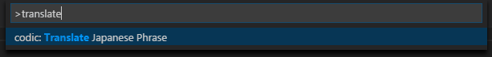
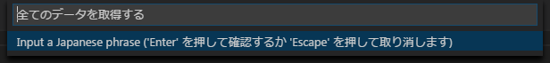
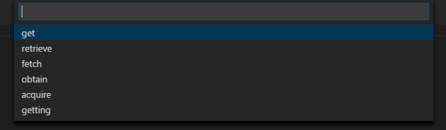
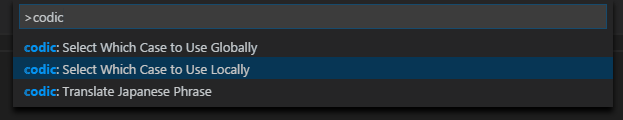
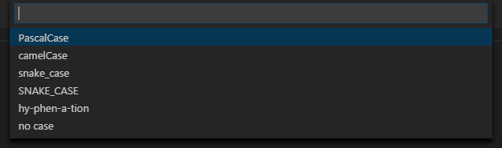

# codic

ネーミングツール [codic](https://codic.jp) を VS Code のコマンドパレットから操作できるようにする拡張機能です。

## 使い方
※ 事前に後述の「設定」を行う必要があります。

コマンドパレットから以下のコマンドを選択します。
```
codic: Translate Japanese Phrase
```


表示された入力欄に、翻訳したい文字列を入力します。  


それぞれの単語に対応する訳語の一覧が表示されるので、適当なものを選択します。  
※ \<null\> という選択肢は、訳出しないことを意味します。  


選択した単語が入力されます。

## 動作環境

Visual Studio Code 1.5.0以上

## インストール
コマンドパレットに以下のコマンドを入力してください。
```
ext install codic
```
Marketplace の検索結果が表示されるので、この拡張機能を選択し、インストールしてください。

## 設定

### アクセストークンの設定
この拡張機能を利用するには、codic API のアクセストークンを設定することが必要です。  
アクセストークンは[こちら](https://codic.jp/my/api_status)で取得できます。  
`メニューバー > ファイル > 基本設定 > ユーザー設定` から `settings.json` を開き、以下のように記述を追加してください。
```json
{
    "codic.API_KEY": "取得したアクセストークン"
}
```  

### case の設定
単語の連結方法を、
- `PascalCase`
- `camelCase`
- `snake_case`
- `SNAKE_CASE`
- `hy-phen-a-tion` (ハイフン区切り)
- `no case` (空白区切り)

から選ぶことができます。

現在のワークスペースにのみ適用する場合、
```
codic: Set Which Case to Use Locally
```
全てのワークスペースに適用する場合、
```
codic: Set Which Case to Use Globally
```
をコマンドパレットから選択し、表示された選択肢から使用したい case を選択してください。  
  


## ライセンス
この拡張機能は [MIT License](LICENSE.txt) の下で利用可能です。  
ソースコードは以下の GitHub リポジトリをご参照ください。  
[https://github.com/pizzacat83/codic-vscode-extension](https://github.com/pizzacat83/codic-vscode-extension)

## バグ報告
[GitHub リポジトリの Issue](https://github.com/pizzacat83/codic-vscode-extension/issues) までご報告ください。  
※ ver 0.0.1 時点ではエラー処理をほとんどやっていません。そのうち実装します。

### 既知の不具合
- QuickPick の表示中に Esc や QuickPick 外クリックなどでキャンセルしようとすると、何も入力されず次の単語の QuickPick が表示される

## TODO
- codic のプロジェクトを選択可能にする
- case とプロジェクトをステータスバーに表示し、ステータスバーから変更可能にする
- コードの一部を選択している時は、選択範囲の文字列を翻訳するようにする

## リリースノート

### 0.0.1
- codic 拡張機能公開
